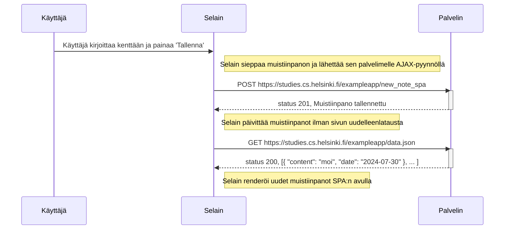

```mermaid
sequenceDiagram
    participant user as Käyttäjä
    participant browser as Selain
    participant server as Palvelin

    user->>browser: Käyttäjä kirjoittaa kenttään ja painaa 'Tallenna'
    
    Note right of browser: Selain sieppaa muistiinpanon ja lähettää sen palvelimelle AJAX-pyynnöllä
    
    browser->>server: POST https://studies.cs.helsinki.fi/exampleapp/new_note_spa
    activate server

    server-->>browser: status 201, Muistiinpano tallennettu
    deactivate server

    Note right of browser: Selain päivittää muistiinpanot ilman sivun uudelleenlatausta
    
    browser->>server: GET https://studies.cs.helsinki.fi/exampleapp/data.json
    activate server
    server-->>browser: status 200, [{ "content": "moi", "date": "2024-07-30" }, ... ]
    deactivate server
    
    Note right of browser: Selain renderöi uudet muistiinpanot SPA:n avulla

```