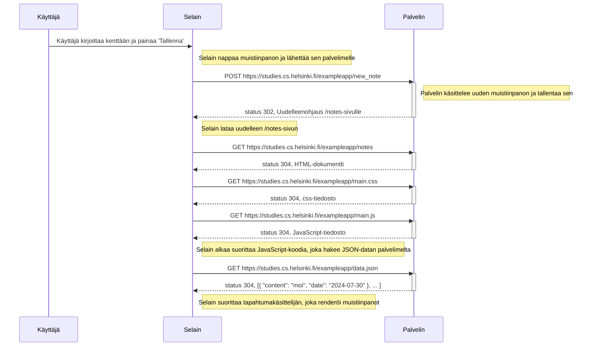

```mermaid
sequenceDiagram
    participant user as Käyttäjä
    participant browser as Selain
    participant server as Palvelin

    user->>browser: Käyttäjä kirjoittaa kenttään ja painaa 'Tallenna'
    
    Note right of browser: Selain nappaa muistiinpanon ja lähettää sen palvelimelle
    
    browser->>server: POST https://studies.cs.helsinki.fi/exampleapp/new_note
    activate server
    Note right of server: Palvelin käsittelee uuden muistiinpanon ja tallentaa sen
    server-->>browser: status 302, Uudelleenohjaus /notes-sivulle
    deactivate server

    Note right of browser: Selain lataa uudelleen /notes-sivun
    
    browser->>server: GET https://studies.cs.helsinki.fi/exampleapp/notes
    activate server
    server-->>browser: status 304, HTML-dokumentti
    deactivate server
    
    browser->>server: GET https://studies.cs.helsinki.fi/exampleapp/main.css
    activate server
    server-->>browser: status 304, css-tiedosto
    deactivate server
    
    browser->>server: GET https://studies.cs.helsinki.fi/exampleapp/main.js
    activate server
    server-->>browser: status 304, JavaScript-tiedosto
    deactivate server
    
    Note right of browser: Selain alkaa suorittaa JavaScript-koodia, joka hakee JSON-datan palvelimelta
    
    browser->>server: GET https://studies.cs.helsinki.fi/exampleapp/data.json
    activate server
    server-->>browser: status 304, [{ "content": "moi", "date": "2024-07-30" }, ... ]
    deactivate server    

    Note right of browser: Selain suorittaa tapahtumakäsittelijän, joka renderöi muistiinpanot

```
