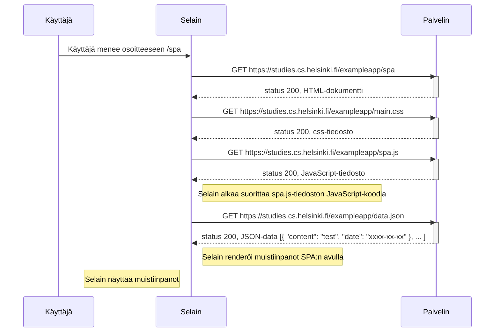

```mermaid
sequenceDiagram
    participant user as Käyttäjä
    participant browser as Selain
    participant server as Palvelin

    user->>browser: Käyttäjä menee osoitteeseen /spa
    
    browser->>server: GET https://studies.cs.helsinki.fi/exampleapp/spa
    activate server
    server-->>browser: status 200, HTML-dokumentti
    deactivate server
    
    browser->>server: GET https://studies.cs.helsinki.fi/exampleapp/main.css
    activate server
    server-->>browser: status 200, css-tiedosto
    deactivate server
    
    browser->>server: GET https://studies.cs.helsinki.fi/exampleapp/spa.js
    activate server
    server-->>browser: status 200, JavaScript-tiedosto
    deactivate server
    
    Note right of browser: Selain alkaa suorittaa spa.js-tiedoston JavaScript-koodia
    
    browser->>server: GET https://studies.cs.helsinki.fi/exampleapp/data.json
    activate server
    server-->>browser: status 200, JSON-data [{ "content": "test", "date": "xxxx-xx-xx" }, ... ]
    deactivate server

    Note right of browser: Selain renderöi muistiinpanot SPA:n avulla
    Note left of browser: Selain näyttää muistiinpanot

```