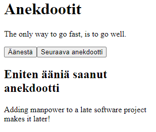

## Osa 1

Tässä osassa tutustutaan React-kirjastoon, jolla tehdään sovelluksen selaimessa suoritettava koodi. Osassa katsastetaan myös Javascriptin Reactin kannalta oleellisimpia ominaisuuksia.

**osa-alueet**
* Reactin alkeet 
* JavaScriptiä 
* Komponentin tila ja tapahtumankäsittely
* Monimutkaisempi tila, Reactin debuggaus

## kurssitiedot (tehtävät 1.1, 1.2, 1.3, 1.4 ja 1.5)

_part1/kurssitiedot/src/App.jsx_

**Sovellus toimii seuraavasti:**

Kurssin tiedot (nimi ja osat) määritellään App-komponentissa.

_App_-komponentti välittää nämä tiedot propsien avulla alikomponenteille.

_Header_-komponentti näyttää kurssin nimen.

_Content_-komponentti käy läpi kurssin osat ja renderöi jokaisesta Part-komponentin.

_Part_-komponentti näyttää yhden osan nimen ja tehtävien määrän.

_Total_-komponentti laskee ja näyttää kaikkien osien tehtävien yhteismäärän.

## unicafe (tehtävät 1.6, 1.7, 1.8, 1.9, 1.10 ja 1.11)

_part1/unicafe/src/App.jsx_

**Sovellus toimii seuraavanlaisesti:**

Käyttäjä antaa palautetta valitsemalla yhden kolmesta palautteenantomahdollisuudesta: hyvä, neutraali tai huono.

_App_-komponentti hallitsee palautteiden kolmella _`useState`_ -hookilla (pitää kirjaa "Good", "Neutral" ja "Bad" -palautteista)
    
_App_-komponentti myös renderöi seuraavat alikomponentit ja välittää niille tarvittavat tiedot propsien avulla:

  - _Button_-komponentti, joka renderöi yksittäisen palautteenantonapin ja käsittelee sen klikkauksen.

  - _Statistics_-komponentti, joka laskee ja näyttää kaikki tilastot. Jos palautteita ei ole annettu, komponentti näyttää viestin "No feedback given".

  - _StatisticLine_-komponentti, joka näyttää yksittäisen tilastorivin (esimerkiksi palautetyyppi ja määrä).

Tilastotiedot sisältävät palautteiden kokonaismäärän, keskiarvon sekä positiivisten palautteiden prosenttiosuuden. Tilastot näytetään HTML-taulukkona.

Käyttäjä voi antaa palautetta klikkaamalla nappeja, ja sovellus päivittää tilastot reaaliajassa näiden klikkausten perusteella.

## anekdootit (tehtävät 1.12, 1.13 ja 1.14)

_part1/anekdootit/src/App.jsx_

**Sovellus toimii seuraavanlaisesti:**

Sovellus esittää ohjelmointiin liittyvät anekdootin ja mahdollistaa käyttäjälle anekdootin äänestämisen. 

Eniten ääniä saanut anekdootti näytetään alla. 

## Sovelluksen Rakenne

_App_-komponentti on pääkomponentti, joka hallitsee anekdoottien näyttämistä, äänestämistä ja tilastoja (alustettu arvoon `0`)

  _Tilat:_

    - _selected_ (number): Indeksi, joka määrittää nykyisesti näytettävän anekdootin anecdotes-taulukosta. Alustettu arvoon 0.
    - _votes_ (array): Taulukko, joka tallentaa jokaisen anekdootin saamien äänten määrän. Alustettu taulukkoon, jossa on yhtä monta nollaa kuin on anekdootteja.

**Funktiot:**

- _getRandomAnecdote:_ Valitsee satunnaisen anekdootin näyttämiseksi
- _voteForAnecdote:_ Lisää äänen nykyiselle anekdootille. Kopioi votes-taulukon, lisää äänen nykyisen anekdootin kohdalle ja päivittää votes-tilan.
- _getMostVotedAnecdote:_ Palauttaa eniten ääniä saaneen anekdootin. Löytää äänten maksimiarvon ja käyttää sitä löytääkseen indeksin, jolla on suurin äänten määrä.
