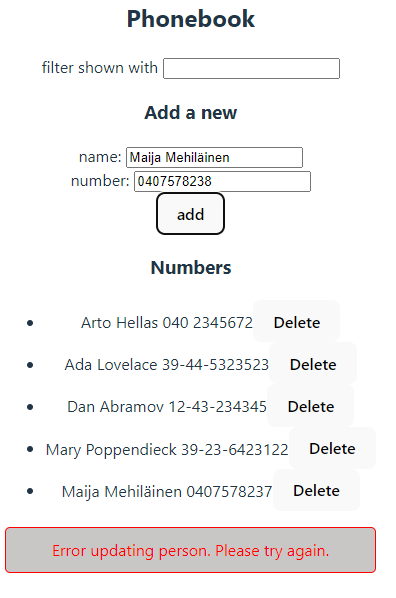

## Osa 2

Tässä osassa jatketaan Reactiin tutustumista (esim. useamman taulukkoon sijoitetun nimen renderöinti ruudulle). Tarkastellaan myös miten käyttäjä voi antaa tietoja React-sovellukselle HTML:n lomakkeiden avulla sekä miten JavaScript -koodi käsittelee palvelimelle tallennettua dataa. 

**osa-alueet**
* Kokoelmien renderöinti ja moduulit
* Lomakkeiden käsittely
* Palvelimella olevan datan hakeminen
* Palvelimella olevan datan muokkaaminen
* Tyylien lisääminen react -sovellukseen

## kurssitiedot (tehtävät 2.1, 2.2, 2.3, 2.4 ja 2.5)

_part2/kurssitiedot/src_

**Sovellus toimii seuraavasti:**

Tämä on yksinkertainen React-sovellus, joka renderöi kurssien ja niiden osien tietoja sekä laskee ja näyttää yhteenlasketun tehtävien määrän jokaiselle kurssille.

`App`-komponentti on sovelluksen pääkomponentti, joka sisältää kurssien tiedot ja renderöi Course-komponentin jokaiselle kurssille.

_components/Course.jsx_

`Course`-komponentti vastaa yksittäisen kurssin tietojen renderöinnistä. Se sisältää seuraavat alikomponentit:

_Header:_ Renderöi kurssin nimen.

_Part:_ Renderöi yhden osan nimen ja tehtävien määrän.

_Content:_ Renderöi kaikki osat käyttämällä Part-komponenttia.

_Total:_ Laskee ja renderöi kaikkien osien tehtävien yhteismäärän.

## puhelinluettelo (tehtävät 2.6, 2.7, 2.8, 2.9, 2.10, 2.11, 2.12, 2.13, 2.14, 2.15, 2.16 ja 2.17)

_part2_/puhelinluettelo/src_

**Sovellus toimii seuraavanlaisesti:**

Tämä on yksikertainen puhelinluettelona toimiva sovellus. 

- Lisää uusia yhteystietoja nimellä ja puhelinnumerolla.
- Suodata yhteystietoja nimen perusteella.
- Näytä lista kaikista yhteystiedoista.

`App`-komponentti on sovelluksen pääkomponentti. Se hallitsee tilaa ja käsittelee logiikan, kuten yhteystietojen lisäämisen, suodattamisen ja näyttämisen.

`Filter`-komponentti tarjoaa syöttökentän, jonka avulla käyttäjä voi suodattaa yhteystietoja nimen perusteella. Se vastaanottaa `filter`-tilan ja `handleFilterChange`-funktiokutsun, joita käytetään suodattimen tilan hallintaan.

`PersonForm`-komponentti on lomake, jonka avulla käyttäjä voi lisätä uusia yhteystietoja. Se sisältää kentät nimen ja puhelinnumeron syöttämiseksi sekä nappulan, jolla lomake lähetetään.

`Persons`-komponentti näyttää listan yhteystiedoista. Se renderöi jokaisen henkilön nimen ja puhelinnumeron.

- **Onnistumisilmoitukset:** Näyttää vihreän taustan ja viestin, joka kertoo onnistuneesta operaatiosta, kuten henkilön lisäämisestä, numeron päivittämisestä tai henkilön poistamisesta.
- **Virheilmoitukset:** Näyttää punaisen taustan ja viestin, joka kertoo epäonnistuneesta operaatiosta.

## maantieto (tehtävät 2.18, 2.19 ja 2.20)

_part2_/maantieto/src

**Sovellus toimii seuraavanlaisesti:**

Tämä on yksinkertainen React-sovellus, joka näyttää tietoja eri maista, kuten maassa puhuttavat kielet ja sääolosuhteet.
Sovellus hakee tiedot REST Countries -API:sta ja säätiedot OpenWeatherMap API:sta.

**Hae maita:** Käyttäjät voivat hakea maita hakupalkin avulla.
- **Näytä maan tiedot:** Hakutuloksista valitun maan tiedot, kuten pääkaupunki, väkiluku ja kielet, näytetään.
- **Säätiedot:** Näyttää valitun maan pääkaupungin säätiedot OpenWeatherMap API:n avulla.

